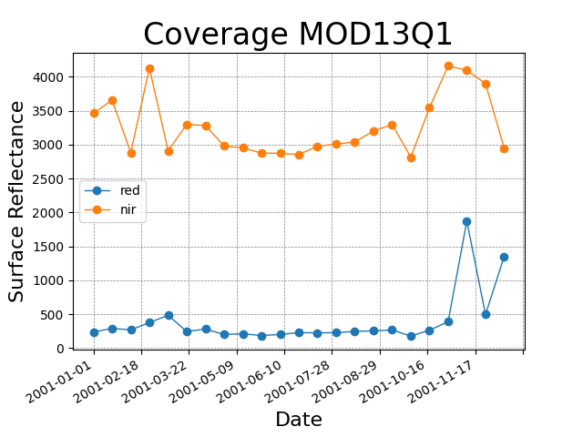

..
    This file is part of Python Client Library for WTSS.
    Copyright (C) 2022 INPE.

    This program is free software: you can redistribute it and/or modify
    it under the terms of the GNU General Public License as published by
    the Free Software Foundation, either version 3 of the License, or
    (at your option) any later version.

    This program is distributed in the hope that it will be useful,
    but WITHOUT ANY WARRANTY; without even the implied warranty of
    MERCHANTABILITY or FITNESS FOR A PARTICULAR PURPOSE. See the
    GNU General Public License for more details.

    You should have received a copy of the GNU General Public License
    along with this program. If not, see <https://www.gnu.org/licenses/gpl-3.0.html>.

Usage
=====

Creating a Python code to retrieve a time series
------------------------------------------------

Import the ``wtss`` class and then use it to create an object to retrieve the time series as shown in the following example:

.. note::

    If you would like to access Brazil Data Cube Time Series, you must have an `Account <https://brazildatacube.dpi.inpe.br/portal/>`_ and give the *User Personal Access Token* to the service instantiation like below:

.. code-block:: python

    from wtss import *

    service = WTSS('https://brazildatacube.dpi.inpe.br', access_token='CHANGE_ME')

The object ``service`` allows to list the available coverages:

.. code-block:: python

    print(service.coverages)

Result::

    ['MOD13Q1-6', 'MYD13Q1-6', 'S2-casassola_10-1', 'S2-casassola_10_16D_STK-1', 'S2QMD_10_16D_STK-1', 'S2QMD_10-1', 'S2-recent_10_16D_STK-1', 'S2-SEN2COR_10_16D_STK-1', 'LT5-MTA-CS_30_3M_STK-1', 'LT5-MTA-N_30_3M_STK-1', 'LT5-CAT_30_3M_STK-1', 'CB4MUX_20-1', 'LC8_30_16D_STK-1', 'CB4MUX_20_1M_STK-1', 'LC8-MOSAIC_30-1', 'LC8_30_6M_MEDSTK-1', 'CB4_64_16D_STK-1', 'LANDSAT-MOZ_30_1M_STK-1', 'S2V3_10_16D_LCF-1', 'S2-16D-2', 'CBERS-WFI_64_8D_LCF-1']

It also allows to retrieve a coverage object with its metadata:

.. code-block:: python

    coverage = service['MOD13Q1-6']

    print(coverage)

Result::

    Coverage: MOD13Q1-6

In order to retrieve the time series for attributes ``red_reflectance`` and ``NIR_reflectance``, in the location of ``latitude -12`` and ``longitude -54`` from ``January 1st, 2001`` tp ``December 31st, 2001``, use the ``ts`` method:

.. code-block:: python

    ts = coverage.ts(attributes=('red_reflectance', 'NIR_reflectance'),
                     latitude=-12.0, longitude=-54.0,
                     start_datetime='2001-01-01', end_datetime='2001-12-31')

Then, you can access the time series values through the name of the attributes:

.. code-block:: python

    print('red values:', ts.red_reflectance)

    print('nir values:', ts.NIR_reflectance)

Result::

    red values: [236.0, 289.0, ..., 494.0, 1349.0]

    nir values: [3463.0, 3656.0, ..., 3901.0, 2948.0]

It is also possible to access the time points associated to the values:

.. code-block:: python

    print(ts.timeline)

Result::

    [datetime.date(2001, 1, 1), ..., datetime.date(2001, 12, 19)]

If you have Matplotlib and Numpy, it is possible to plot the time series with the ``plot`` method:

.. code-block:: python

    ts.plot()

More examples can be found in the :ref:`Section Examples <Examples>`.

Command-Line Interface (CLI)
----------------------------

The ``WTSS`` client installs a command line tool named ``wtss`` that allows to retrive time series data.

If you want to know the WTSS version, use the option ``--version`` as in::

    wtss --version

Output::

    wtss, version 0.7.0

To list the available coverages in a service, use the ``list-coverages`` command and provides a URL to the ``--url`` option::

    wtss list-coverages --url https://brazildatacube.dpi.inpe.br

Output::

    MOD13Q1-6
    MYD13Q1-6
    S2-SEN2COR_10_16D_STK-1
    LC8_30_16D_STK-1
    CB4MUX_20_1M_STK-1
    LC8_30_6M_MEDSTK-1
    CB4_64_16D_STK-1
    LANDSAT-MOZ_30_1M_STK-1
    CBERS-WFI_64_8D_LCF-1

To get more information about a specific coverage, use the ``describe`` command::

    wtss describe --coverage MOD13Q1-6 --url https://brazildatacube.dpi.inpe.br

Output:

.. code-block:: json

    {
        "name": "MOD13Q1-6",
        "description": "Vegetation Indices 16-Day L3 Global 250m",
        "detail": "https://lpdaac.usgs.gov/dataset_discovery/modis/modis_products_table/mod13q1_v006",
        "dimensions": { },
        "spatial_extent": { },
        "spatial_resolution": { },
        "crs": { },
        "timeline": [ ],
        "attributes": [ ]
    }

Finally, to retrieve the time series over a coverage in a specific location::

    wtss ts --coverage MOD13Q1-6 \
            --attributes red \
            --longitude -54 --latitude -12 \
            --start-date 2001-01-01 --end-date 2001-12-31 \
            --url https://brazildatacube.dpi.inpe.br \
            --access-token CHANGE_ME

.. note::

    You may also need to pass the parameter ``--access_token=CHANGE_ME`` to retrieve time series.

If you want to know more about commands and their options, use the help::

    wtss --help

    wtss describe --help
